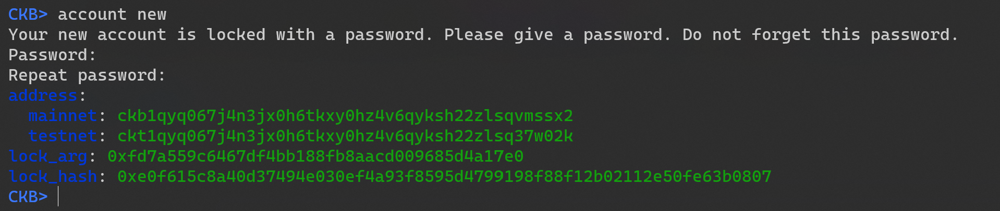
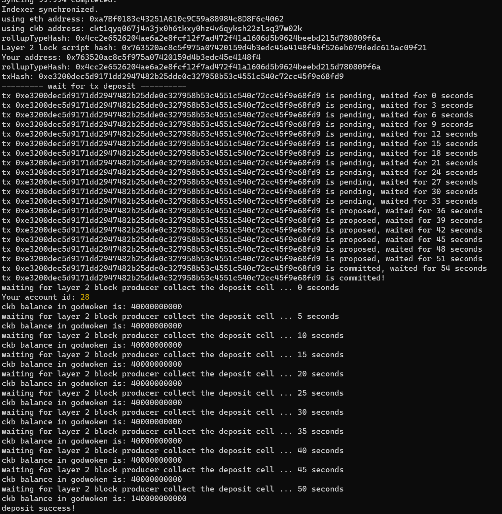

# Gitcoin: 1) Create A Godwoken Account On The EVM Layer 2 Testnet
## account-new
A screenshot of the accounts you created (account list) in ckb-cli.

## link on the explorer
A link to the Layer 1 address you funded on the Testnet Explorer.
https://explorer.nervos.org/aggron/address/ckt1qyq067j4n3jx0h6tkxy0hz4v6qyksh22zlsq37w02k
## deposit to L2
A screenshot of the console output immediately after you have successfully submitted a deposit to Layer 2.
