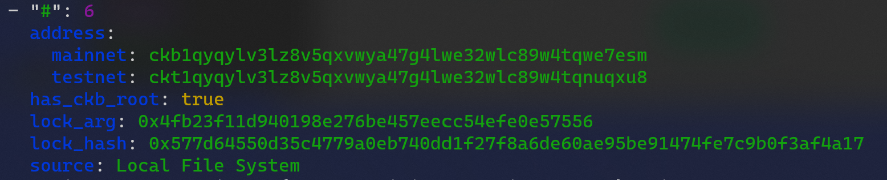
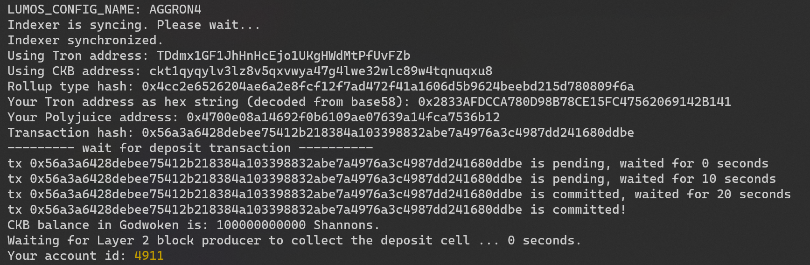
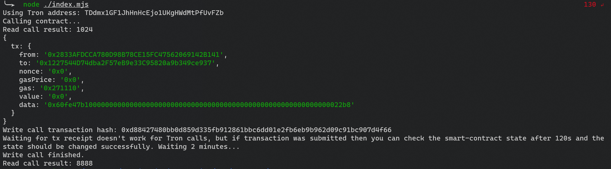

# Gitcoin: 11) Use A Tron Wallet To Execute A Smart Contract Call

## A screenshot of the accounts you created (account list) in ckb-cli.

## A link to the Layer 1 address you funded on the Testnet Explorer.
https://explorer.nervos.org/aggron/address/ckt1qyqylv3lz8v5qxvwya47g4lwe32wlc89w4tqnuqxu8
## A screenshot of deposit output

## A screenshot of smart contract call

## The transaction hash of the "Contract call" from the console output
0xd88427480bb0d859d335fb912861bbc6dd01e2fb6eb9b962d09c91bc907d4f66
## The contract address that you called
0x1227544D74dba2F57eB9e33C95820a9b349ce937
## The ABI for contract you made a call on
```js
const CONTRACT_ABI = [{
  inputs: [],
  stateMutability: "payable",
  type: "constructor",
},
{
  inputs: [{
    internalType: "uint256",
    name: "x",
    type: "uint256",
  },],
  name: "set",
  outputs: [],
  stateMutability: "payable",
  type: "function",
},
{
  inputs: [],
  name: "get",
  outputs: [{
    internalType: "uint256",
    name: "",
    type: "uint256",
  },],
  stateMutability: "view",
  type: "function",
},
]; // this should be an Array []
```
## Tron address
TDdmx1GF1JhHnHcEjo1UKgHWdMtPfUvFZb