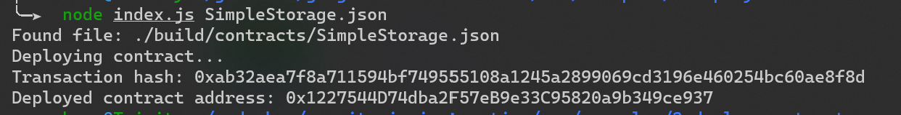

# Gitcoin: 2) Deploy A Simple Ethereum Smart Contract On Polyjuice
## deploy-contract
A screenshot of the console output immediately after you have successfully deployed a smart contract.

## transaction hash
0xab32aea7f8a711594bf749555108a1245a2899069cd3196e460254bc60ae8f8d
## deployed contract address
0x1227544D74dba2F57eB9e33C95820a9b349ce937