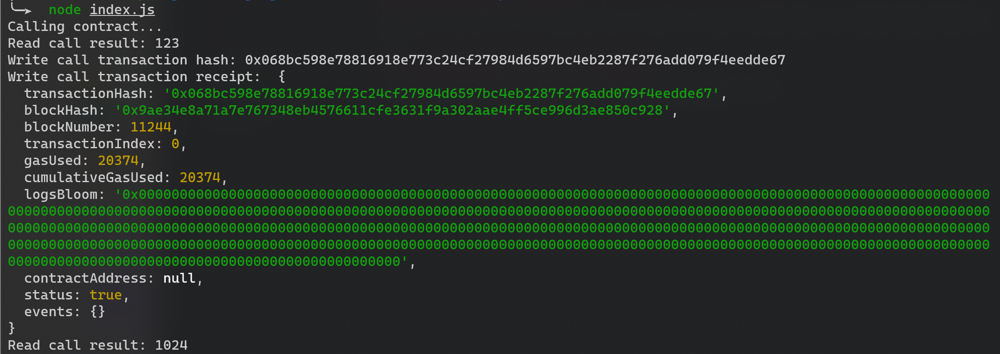

# Gitcoin: 3) Issue A Smart Contract Call To The Deployed Smart Contract
## screenshot
A screenshot of the console output immediately after you have successfully issued a smart contract call.

## transaction hash
0x068bc598e78816918e773c24cf27984d6597bc4eb2287f276add079f4eedde67
## called contract address
0x1227544D74dba2F57eB9e33C95820a9b349ce937
## ABI
```js
const CONTRACT_ABI = [{
  inputs: [],
  stateMutability: "payable",
  type: "constructor",
},
{
  inputs: [{
    internalType: "uint256",
    name: "x",
    type: "uint256",
  },],
  name: "set",
  outputs: [],
  stateMutability: "payable",
  type: "function",
},
{
  inputs: [],
  name: "get",
  outputs: [{
    internalType: "uint256",
    name: "",
    type: "uint256",
  },],
  stateMutability: "view",
  type: "function",
},
]; // this should be an Array []
