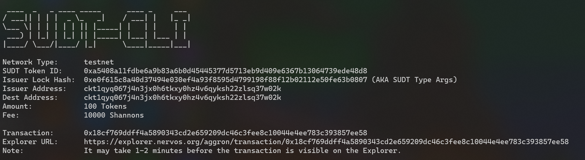
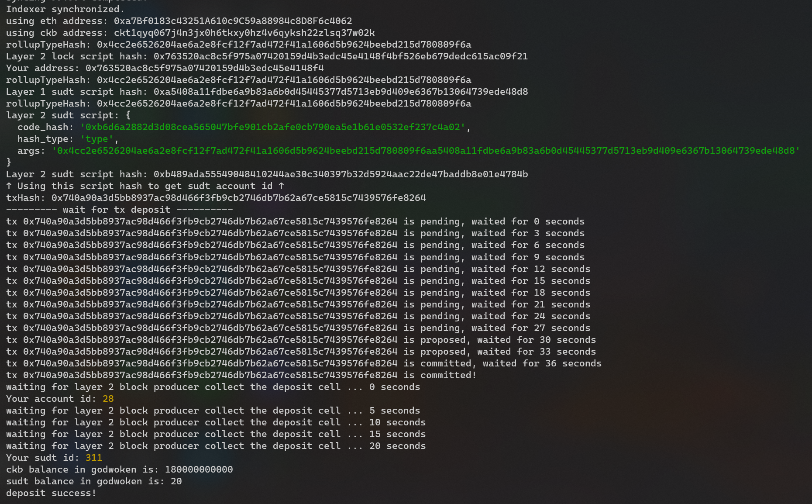

# Gitcoin: 4) Issue An SUDT Token On Layer 1 And Deposit It To Layer 2
## link to the Layer 1 address
https://explorer.nervos.org/aggron/address/ckt1qyq067j4n3jx0h6tkxy0hz4v6qyksh22zlsq37w02k
## screenshot of issue
A screenshot of the console output immediately after using sudt-cli to create your SUDT tokens on Layer 1.

## link to the transaction ID
https://explorer.nervos.org/aggron/transaction/0x18cf769ddff4a5890343cd2e659209dc46c3fee8c10044e4ee783c393857ee58
## screenshot of deposit
A screenshot of the console output immediately after you have successfully submitted a deposit to Layer 2 using the account-cli tool.

## SUDT ID
311