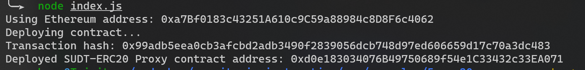
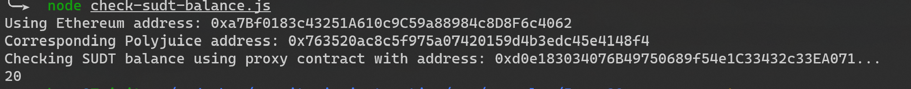

# Gitcoin: 5) Deploy The ERC20 Proxy Contract For The Deposited SUDT
## screenshot of deploy proxy contract

## address of the ERC20 Proxy Contract
0xd0e183034076B49750689f54e1C33432c33EA071
## screenshot of check sudt balance

## Ethereum address that was checked
0xa7Bf0183c43251A610c9C59a88984c8D8F6c4062
