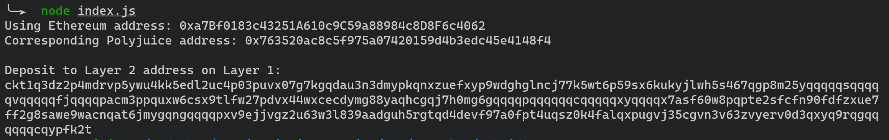

# Gitcoin: 6) Use Force Bridge To Deposit Tokens From Ethereum To Polyjuice
## screenshot of Deposit Receiver Address.

## Deposit Receiver Address
ckt1q3dz2p4mdrvp5ywu4kk5edl2uc4p03puvx07g7kgqdau3n3dmypkqnxzuefxyp9wdghglncj77k5wt6p59sx6kukyjlwh5s467qgp8m25yqqqqqsqqqqqvqqqqqfjqqqqpacm3ppquxw6csx9tlfw27pdvx44wxcecdymg88yaqhcgqj7h0mg6gqqqqpqqqqqqcqqqqqxyqqqqx7asf60w8pqpte2sfcfn90fdfzxue7ff2g8sawe9wacnqat6jmygqngqqqqpxv9ejjvgz2u63w3l839aadguh5rgtqd4devf97a0fpt4uqsz0k4falqxpugvj35cgvn3v63zvyerv0d3qxyq9rqgqqqqqqcqypfk2t
## Ethereum address
0xa7Bf0183c43251A610c9C59a88984c8D8F6c4062
## link to the Etherscan explorer for the successful Force Bridge transaction
https://rinkeby.etherscan.io/tx/0x9fdeee562edd3ab9834f495c65e5d39ab52ca5dff4f79c88c7b25bdccffc5848
## link to the Nervos explorer for the successful Force bridge transaction
https://explorer.nervos.org/aggron/transaction/0x3aa29680957037f7c6901a0be3136f1b7a7a2422de0b3a54c435f34b0686fc25
